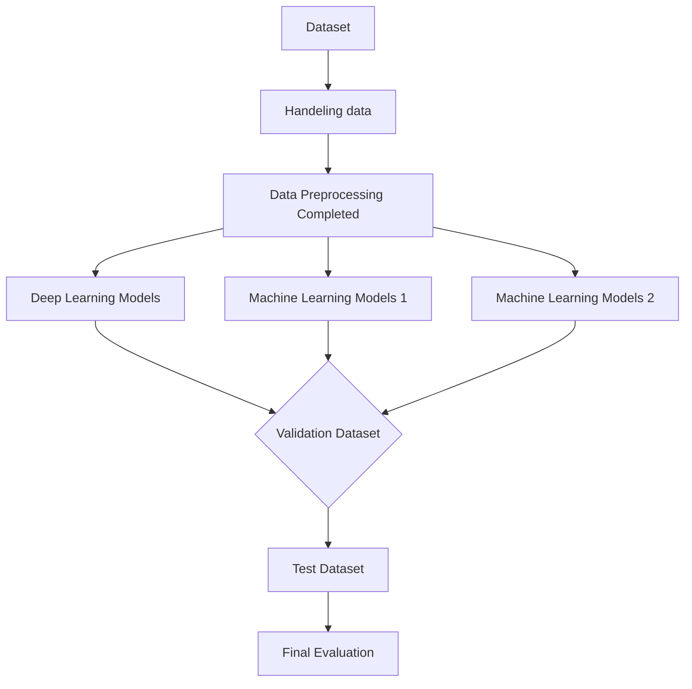

# Kaggle-NLP_with_Disaster_Tweets

## Table of Contents
- [Introduction](#introduction)
- [Dataset Overview](#dataset-overview)
- [Dataset EDA](#dataset-eda)
- [Data Preprocessing](#data-preprocessing)
- [Pipeline](#pipeline)
- [Models Implemented](#models-implemented)
- [Evaluation](#evaluation)
- [Experimental Record](#experimental-record)
- [License](#license)

## Introduction
The **Kaggle-NLP_with_Disaster_Tweets** project is aimed to build a machine learning model that predicts which Tweets are about real disasters and which one's aren't. 
Key characteristics of the dataset include:  
- id: a unique identifier for each tweet
- text: the text of the tweet
- location: the location the tweet was sent from (may be blank)
- keyword: a particular keyword from the tweet (may be blank)
- target: in train.csv only, this denotes whether a tweet is about a real disaster (1) or not (0)

## Dataset Overview
### Files
- train.csv: the training set
- test.csv: the test set
- sample_submission.csv: a sample submission file in the correct format

## Dataset EDA

  

  

  

  

## Data Preprocessing  
1. **Step 1: Handling data**  
    - Applied `dropna` to ensure data completeness.
    - Clean text by removing URLs, HTML, and acronyms

## Pipeline

## Models Implemented  

### Machine Learning Models 1
- **Linear Models**:  
  - Ridge Classifier   
  - Logistic Regression  

- **Decision Trees and Ensemble Models**:  
  - Decision Tree  
  - Random Forest  
  - XGBoost  
  - Voting Classifier

### Machine Learning Models 2

- **Decision Trees and Ensemble Models**:  
  - XGBoost  
  - Random Forest  
  - LightBGM
  - Stacking Classifier  
  - Voting Classifier (soft, hard)

### Deep Learning Models
  - RNN

## Evaluation
We use F1 score as our performance metric.

## Experimental Record

## License
This project is licensed under the MIT License - see the [LICENSE](LICENSE) file for details.
