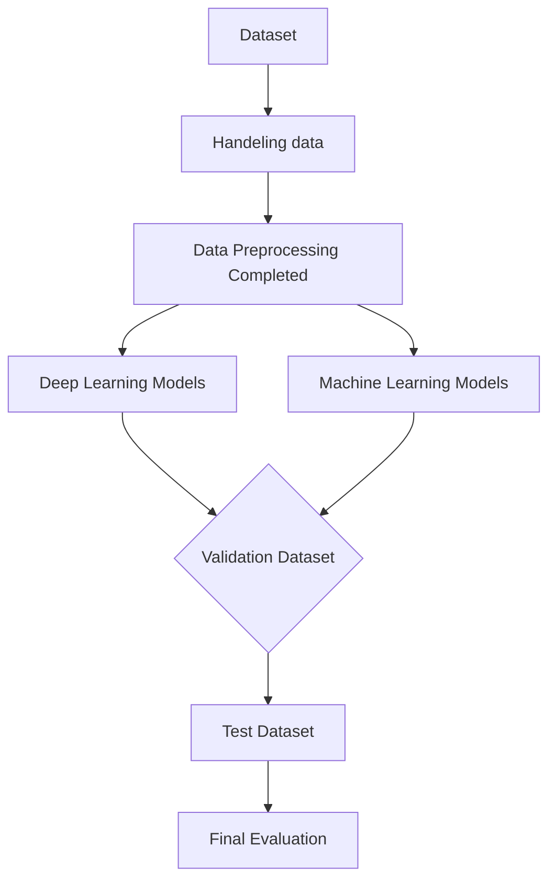

# Kaggle-NLP_with_Disaster_Tweets

## Table of Contents
- [Introduction](#introduction)
- [Dataset Overview](#dataset-overview)
- [Dataset EDA](#dataset-eda)
- [Data Preprocessing](#data-preprocessing)
- [Pipeline](#pipeline)
- [Models Implemented](#models-implemented)
- [Evaluation](#evaluation)
- [Experimental Record](#experimental-record)
- [License](#license)

## Introduction
The **Kaggle-NLP_with_Disaster_Tweets** project is aimed to build a machine learning model that predicts which Tweets are about real disasters and which one's aren't. 
Key characteristics of the dataset include:  
- id
- keyword
- location
- text

## Dataset Overview
- test.cvs

## Dataset EDA

## Data Preprocessing  
1. **Step 1: Handling data**  
    - Applied `dropna` to ensure data completeness.
    - Clean text by removing URLs, HTML, and acronyms

## Pipeline

## Models Implemented  

### Machine Learning Models  
- **Linear Models**:  
  - Ridge Classifier   
  - Logistic Regression  

- **Decision Trees and Ensemble Models**:  
  - Decision Tree  
  - Random Forest  
  - XGBoost  
  - Voting Classifier

### Deep Learning Models

## Evaluation
We use F1 score as our performance metric.

## Experimental Record

## License
This project is licensed under the MIT License - see the [LICENSE](LICENSE) file for details.